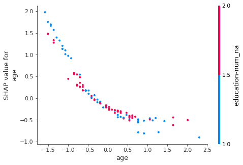

# FastSHAP (V1)
> This project brings in part of the `SHAP` library into `fastai` (V1) and make it compatible. Thank you to Nestor Demeure for his assistance with the project!

## Install

`pip install fastshapv1`

## How to use

First we'll quickly train a `ADULTS` tabular model

```
from fastai.tabular import *
```

```
path = untar_data(URLs.ADULT_SAMPLE)
df = pd.read_csv(path/'adult.csv')
```

```
dep_var = 'salary'
cat_names = ['workclass', 'education', 'marital-status', 'occupation', 'relationship', 'race']
cont_names = ['age', 'fnlwgt', 'education-num']
procs = [FillMissing, Normalize, Categorify]
```

```
dls = (TabularList.from_df(df, path=path, cat_names=cat_names, cont_names=cont_names, procs=procs)
                           .split_by_idx(list(range(800,1000)))
                           .label_from_df(cols=dep_var)
                           .databunch())
```

```
learn = tabular_learner(dls, layers=[200,100], metrics=accuracy)
learn.fit(1, 1e-2)
```

And now for some example usage!

```
from fastshap.interp import *
```

```
exp = ShapInterpretation(learn, df.iloc[:100])
```

```
exp.dependence_plot('age')
```


    Classification model detected, displaying score for the class <50k.
    (use `class_id` to specify another class)





For more examples see [01_Interpret](https://github.com/muellerzr/fastshap/blob/fastaiv1/nbs/01_interpret.ipynb)


*For more unofficial fastai extensions, see the [Fastai Extensions Repository](https://github.com/nestordemeure/fastai-extensions-repository).*
